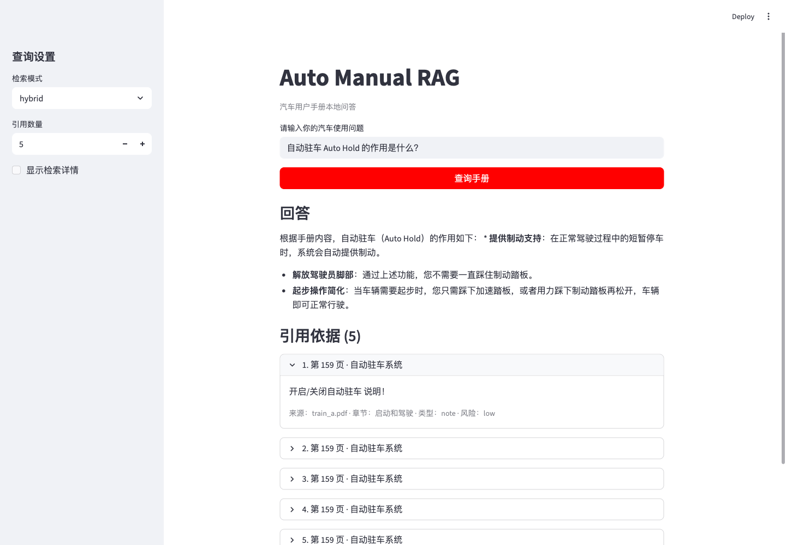
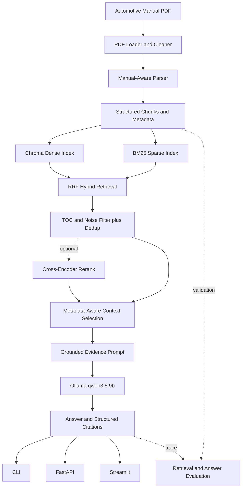

# Auto Manual RAG

面向汽车用户手册的本地可追溯问答应用。系统从 PDF 中恢复章节结构，使用 Dense + BM25 + RRF 混合检索组织证据，再由本地 `qwen3.5:9b` 基于证据生成回答并返回页码、章节和原文引用。

这个项目关注完整的 AI Application pipeline，而不只是把 PDF 放入向量数据库：它包含结构感知解析、索引卫生、混合检索、Grounded Generation、FastAPI/Streamlit/CLI 入口，以及可复现的 retrieval/answer evaluation。

## Demo



真实系统输出示例：

> **问题：** 自动驻车 Auto Hold 的作用是什么？
>
> **回答：**
> - **提供制动支持**：在正常驾驶过程中的短暂停车时，系统会自动提供制动。
> - **解放驾驶员脚部**：通过上述功能，您不需要一直踩住制动踏板。
> - **起步操作简化**：当车辆需要起步时，您只需踩下加速踏板，或者用力踩下制动踏板再松开，车辆即可正常行驶。
>
> **引用：** 用户手册第 159 页，`启动和驾驶 > 自动驻车系统`。

示例来自当前 `qwen3.5:9b` 稳定链路；系统实际响应同时返回结构化 citations。

## Why This Project

汽车用户手册不是普通长文本：

- PDF 抽取容易丢失标题层级、列表、跨页关系和图文布局；
- 目录、页眉页脚、图例和表格残片会污染检索；
- 相邻小节经常共享术语，但操作对象和适用条件不同；
- “警告”“注意”“说明”和操作步骤具有不同安全含义；
- 用户需要可以回到手册核验的答案，而不是模型常识。

因此系统把手册结构、检索证据、回答约束和评测可追溯性作为同一条应用链路设计。

## Core Features

1. **Manual-Aware Parsing**：恢复 `chapter`、`section`、`subsection` 和 `heading_path`，避免只按固定字符切块。
2. **Structured Chunks and Metadata**：保留页码、内容类型、风险等级和跨页信息，用于检索、诊断和引用。
3. **Hybrid Retrieval**：融合 Chroma dense retrieval 与 BM25 sparse retrieval，使用 RRF 统一两路排名。
4. **Evidence Hygiene**：过滤 TOC/noise chunks、清理完全重复内容，并保留可解释的 filter/dedup metadata。
5. **Metadata-Aware Context Selection**：按候选顺序和 metadata 组织最终证据，默认限制为 5 条、6000 字符。
6. **Grounded Answers with Citations**：本地模型只基于明确 Evidence 回答，API 返回 source、page、section 和 quote。
7. **Evaluation and Traceability**：提供 retrieval/answer datasets、benchmark consistency validation、Exact Prompt Evidence、raw/final answer 记录和人工 rubric。
8. **Reproducible Local Generation**：显式记录模型 digest、Ollama 版本、`temperature`、`seed` 和 `think`，并通过受控模型选择确定稳定默认模型。

## Architecture



稳定默认链路为 hybrid no-rerank。Cross-encoder rerank 已实现并评测，但因额外推理成本保持可选。

## Quick Start

### Prerequisites

- Git；
- Python 3.10+ 语法环境，本仓库当前验证环境为 Python 3.14.3；
- [Ollama](https://ollama.com/)；
- 首次下载 embedding/LLM 模型时可访问对应模型源；
- 一份合法获得的汽车用户手册 PDF。

### 1. Clone and install

```bash
git clone https://github.com/Fruiterer333/auto_manual_rag.git
cd auto_manual_rag

python3 -m venv .venv
source .venv/bin/activate
python -m pip install --upgrade pip
python -m pip install -r requirements.txt
```

Windows PowerShell 激活命令：

```powershell
.venv\Scripts\Activate.ps1
```

### 2. Prepare Ollama

先启动 Ollama 服务：

```bash
ollama serve
```

在另一个终端拉取稳定 Answer Model：

```bash
ollama pull qwen3.5:9b
ollama list
```

模型文件约 6.6 GB。默认配置使用 `think=false`、`temperature=0.0`、`seed=42` 和 `stream=false`。

### 3. Configure the application

```bash
cp .env.example .env
```

默认配置使用本地 Ollama、`qwen3.5:9b`、hybrid retrieval 和 no-rerank。可以按本机环境调整数据目录，但不要提交 `.env`。

### 4. Bring your own manual and build indexes

本仓库不分发第三方汽车用户手册。请将合法获得的 PDF 放入 `data/raw/`，例如：

```text
data/raw/manual.pdf
```

构建 Chroma 和 BM25 索引：

```bash
.venv/bin/python scripts/ingest_manual.py \
  --file-path data/raw/manual.pdf \
  --rebuild
```

当前 parser 针对已验证手册的层级特征做了保守校准。更换手册后应使用 `inspect_chunks.py` 抽查 metadata，不应假设冻结评测结果可以直接迁移。

### 5. Ask the first question

```bash
.venv/bin/python scripts/query_manual.py \
  --question "自动驻车 Auto Hold 的作用是什么？" \
  --retrieval-mode hybrid
```

首次运行 embedding 可能需要下载模型。索引和模型缓存完成后，问答链路在本地运行。

## Usage

### Streamlit demo

先启动 API：

```bash
.venv/bin/python -m uvicorn app.main:app --reload
```

再在另一个终端启动 Streamlit：

```bash
.venv/bin/python -m streamlit run frontend/streamlit_app.py
```

- Streamlit：`http://127.0.0.1:8501`
- FastAPI docs：`http://127.0.0.1:8000/docs`
- Health check：`http://127.0.0.1:8000/health`

### FastAPI

```bash
curl http://127.0.0.1:8000/health

curl -X POST http://127.0.0.1:8000/query \
  -H "Content-Type: application/json" \
  -d '{
    "question": "自动驻车 Auto Hold 的作用是什么？",
    "top_k": 5,
    "retrieval_mode": "hybrid"
  }'
```

### Retrieval diagnostics

```bash
.venv/bin/python scripts/query_manual.py \
  --question "充电时有哪些安全注意事项？" \
  --debug-retrieval \
  --retrieval-mode hybrid \
  --use-context-selection
```

```bash
.venv/bin/python scripts/inspect_chunks.py \
  --query "安全带 锁舌 锁扣" \
  --show-full \
  --limit 20
```

### Evaluation

冻结 retrieval benchmark 与当前手册/chunk strategy 绑定。只有使用对应合法手册并重新生成一致索引后，才可复跑：

```bash
.venv/bin/python scripts/validate_retrieval_eval_set.py \
  --dataset data/eval/manual_eval_set.jsonl \
  --split dev

.venv/bin/python scripts/evaluate_retrieval.py \
  --dataset data/eval/manual_eval_set.jsonl \
  --retrieval-mode hybrid \
  --top-k 5 \
  --output /tmp/hybrid.json \
  --output-format json
```

Answer evaluation 会调用本地模型并产生运行报告：

```bash
.venv/bin/python scripts/validate_answer_eval_set.py

.venv/bin/python scripts/evaluate_answers.py \
  --dataset data/eval/answer_eval_set.jsonl \
  --retrieval-mode hybrid \
  --model qwen3.5:9b \
  --think false \
  --top-k 5 \
  --output /tmp/answer_eval.md \
  --json-output /tmp/answer_eval.json
```

## Evaluation Snapshot

### Retrieval

V3.5 冻结 benchmark 包含 69 条 records，其中 68 条 active、1 条因 text-only corpus 无法表示表格数值而 excluded。

| Mode | Hit@1 | Hit@3 | Hit@5 | MRR |
| --- | ---: | ---: | ---: | ---: |
| Hybrid no-rerank, default | 0.6618 | 0.9265 | 0.9706 | 0.7922 |
| Hybrid + optional rerank | 0.8676 | 0.9853 | 1.0000 | 0.9277 |

这些是 68 条 active retrieval dev queries 上的 gold-evidence ranking 指标，不是 answer accuracy。历史单次离线运行中 rerank elapsed 约为 no-rerank 的两倍，因此没有默认开启；该数据也不是 production p95 latency。

### Answer quality and model selection

- 12-case answer dev diagnostic set 的最终 **PROPOSED** Human Full Pass 为 `10/12`；它不是 production accuracy 或跨车型结果。
- 在 Prompt Evidence 对 12/12 cases 完全一致的前提下，对比 `qwen2.5:7b`、`qwen3.5:9b` 和 `gemma3:12b`，最终选择质量与本地成本更平衡的 `qwen3.5:9b`。
- 选定模型在当前 Ollama `0.33.2`、固定 model digest 和 generation config 下完成 4 cases x 3 runs 的 exact-output stability verification；该结论不代表跨硬件或跨 inference backend 的确定性。

详细方法和 claim boundaries 见 [Evaluation Guide](docs/evaluation.md) 与 [Evaluation Report Index](reports/evaluation/README.md)。

## Engineering Decisions

| Decision | Rationale |
| --- | --- |
| Dense + BM25 + RRF | Dense 覆盖语义表达，BM25 覆盖术语和精确短语；RRF 不依赖两路分数尺度一致。 |
| Rerank 默认关闭 | 当前 dev benchmark 上排序收益明确，但额外推理成本较高，保持为 optional high-precision mode。 |
| `qwen3.5:9b` + `think=false` | 三模型受控对比中改善关键条件处理问题，质量与 `gemma3:12b` 接近，但模型更小、本地运行更快。 |
| 显式 `temperature=0` / `seed=42` | 让固定环境中的实验和回归更可审计；不声称跨环境 universal determinism。 |
| 保留 rejected experiment | V4.6 Prompt intervention 未达到预设目标，因此没有合并；报告作为 failure-driven engineering 证据保留。 |
| 不继续 Query Rewrite/Embedding benchmark | 当前证据没有表明它们是 Resume-Ready blocker，避免为了功能数量扩大复杂度。 |

## Known Limitations

- 当前是 single-manual、text-only RAG，不处理图片、按钮图标、OCR 或复杂表格布局。
- 冻结 retrieval benchmark 与当前手册和 chunk strategy 绑定，不是跨品牌外部 test set。
- Answer evaluation 只有 12 条 dev diagnostic cases；`10/12` 是 PROPOSED rubric 结果，不代表生产准确率。
- 部分问题仍受 complementary evidence 或 safety evidence 未进入最终上下文的限制。
- `qwen3.5:9b` 曾出现裸 `E1/E2/E4` 输出；sanitizer 不全局删除裸 `E1`，以免误伤真实故障代码。
- repeated-run stability 只在当前硬件、Ollama 版本、模型 digest 和 backend 下验证。
- 单次本地 elapsed 仅用于离线观察，不是 production latency、SLA 或 p95 benchmark。
- 新手册需要重新检查 parser metadata 和重建评测映射。

## Project Structure

```text
app/                    FastAPI、ingest、RAG 与 evaluation 核心代码
  data/                 PDF loader、cleaner、manual-aware parser/splitter
  rag/                  embeddings、retrievers、reranker、prompt、QAChain
  evaluation/           retrieval/answer validation、metrics、human rubric
frontend/               Streamlit demo
scripts/                ingest、query、inspection、validation、evaluation CLI
data/eval/              retrieval 与 answer dev datasets
docs/                   方法、设计和项目审计
reports/evaluation/     冻结结果、关键实验和历史报告
tests/                  parser、retrieval、generation、evaluation 单元测试
```

## Documentation

- [Evaluation methodology](docs/evaluation.md)
- [Evaluation report index](reports/evaluation/README.md)
- [V3.5 retrieval benchmark summary](reports/evaluation/v3_5_retrieval_benchmark_summary.md)
- [V4.8 final system evaluation](reports/evaluation/v4_8_final_system_evaluation.md)
- [V5.0 portfolio audit](docs/v5_0_portfolio_audit.md)
- [Development constraints](AGENTS.md)

## Future Work

- 使用合法可分发的样例手册建立 fresh-clone demo fixture；
- 扩展多手册/多车型外部评测；
- 补充图片、图标和复杂表格的多模态处理；
- 建立包含 warmup、重复运行和 p50/p95 的正式 latency benchmark；
- 仅在新的 failure evidence 支持时重新评估 rerank、embedding 或 query transformation。

Agent workflow 不属于本项目范围；它应作为独立应用项目展示。

## License

当前仓库尚未选择开源许可证。代码使用权以仓库所有者后续添加的 `LICENSE` 为准。第三方汽车用户手册及其内容不随本仓库授权或分发。
