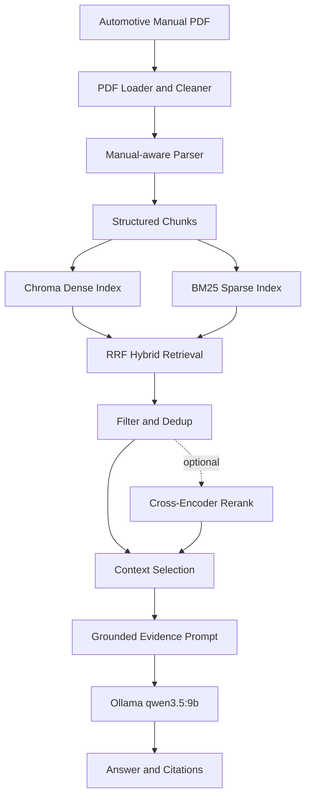

# Auto Manual RAG

面向汽车用户手册的本地 RAG 问答系统。

系统实现了汽车用户手册的结构化解析、混合检索、基于检索证据的回答生成与引用溯源，并提供 CLI、FastAPI 和 Streamlit 三种使用入口，同时建立了检索与回答质量评测流程。

## Demo


> **问题：** 自动驻车 Auto Hold 的作用是什么？
>
> **回答：**  提供制动支持：在正常驾驶过程中的短暂停车时，系统会自动提供制动。 解放驾驶员脚部：通过上述功能，您不需要一直踩住制动踏板。
起步操作简化：当车辆需要起步时，您只需踩下加速踏板，或者用力踩下制动踏板再松开，车辆即可正常行驶。
>
> **引用：** 用户手册第 159 页，`启动和驾驶 > 自动驻车系统`。

## Features

- **Manual-aware parsing**：恢复 `chapter`、`section`、`subsection` 和 `heading_path`，保留页码、风险等级和跨页信息。
- **Hybrid retrieval**：组合 dense retrieval 与 BM25 sparse retrieval，并使用 RRF 融合两路排名。
- **Optional reranking**：支持本地 cross-encoder reranker，默认关闭，可用于更强调 top-1 精度的场景。
- **Evidence hygiene**：过滤目录和低信息噪声，执行精确内容去重，并保留可解释的诊断 metadata。
- **Evidence-grounded answering**：最终上下文限制为最多 5 条、6000 字符，由 Ollama `qwen3.5:9b` 基于明确 Evidence 回答。
- **Traceable evaluation**：提供 Retrieval/Answer 评测数据集、Benchmark 一致性校验、实际入模证据追踪与结构化引用。

## Architecture



默认链路使用 hybrid retrieval，不启用 reranker。

## Quick Start

### Prerequisites

- Git
- Python 3.10+
- [Ollama](https://ollama.com/)
- 首次下载 embedding/LLM 模型时可访问对应模型源

### 1. Clone and install

```bash
git clone https://github.com/Fruiterer333/auto_manual_rag.git
cd auto_manual_rag
python3 -m venv .venv
source .venv/bin/activate
python -m pip install --upgrade pip
python -m pip install -r requirements.txt
```


### 2. Prepare Ollama

```bash
ollama serve
```

在另一个终端执行：

```bash
ollama pull qwen3.5:9b
```

默认 generation configuration 为 `temperature=0.0`、`seed=42`、`stream=false`、`think=false`。

### 3. Configure

```bash
cp .env.example .env
```

### 4. Build indexes from the included manual

仓库包含用于 Demo 和评测复现的手册：`data/manuals/demo_manual.pdf`。

```bash
.venv/bin/python scripts/ingest_manual.py \
  --file-path data/manuals/demo_manual.pdf \
  --rebuild
```

该命令构建 Chroma dense index 和 BM25 sparse index。本地索引保存在忽略目录中，不提交 Git。

### 5. Ask a question

```bash
.venv/bin/python scripts/query_manual.py \
  --question "自动驻车 Auto Hold 的作用是什么？" \
  --retrieval-mode hybrid
```

## Usage

### CLI

```bash
.venv/bin/python scripts/query_manual.py \
  --question "如何正确使用安全带？" \
  --retrieval-mode hybrid
```

### FastAPI

```bash
.venv/bin/python -m uvicorn app.main:app --reload
curl http://127.0.0.1:8000/health
```

API 文档位于 `http://127.0.0.1:8000/docs`。

### Streamlit

FastAPI 运行后，在另一个终端启动：

```bash
.venv/bin/python -m streamlit run frontend/streamlit_app.py
```

访问 `http://127.0.0.1:8501`。

## Evaluation

检索评测包含 68 条 active queries。

| Configuration | Hit@1 | Hit@3 | Hit@5 | MRR |
| --- | ---: | ---: | ---: | ---: |
| Hybrid | 0.6618 | 0.9265 | 0.9706 | 0.7922 |
| Hybrid + Reranker | 0.8676 | 0.9853 | 1.0000 | 0.9277 |

Answer-level evaluation 进一步评估 groundedness、correctness、completeness 和 condition handling，并记录模型实际可见的入模证据（prompt evidence），支持对 retrieval、context selection 与 generation failure 进行分层归因。

- [Evaluation methodology](docs/evaluation.md)
- [Final evaluation report](reports/evaluation/README.md)

## Engineering Decisions

| Decision | Rationale |
| --- | --- |
| Dense + BM25 + RRF | Dense 提供语义召回，BM25 保留术语和精确短语匹配；RRF 可以融合不同分数尺度的排名。 |
| Optional reranker | Cross-encoder 将 Hit@1 从 `0.6618` 提升到 `0.8676`，但增加本地推理开销，因此不作为默认链路。 |
| `qwen3.5:9b` | 在统一 model-visible evidence 的受控对比实验中选定，综合权衡回答质量、模型规模与本地推理开销。 |
| Exact Prompt Evidence | 保存模型实际看到的证据，使回答、citations 和 evaluation 能基于同一上下文审计。 |

## Limitations

- 当前 benchmark 主要来自单份汽车用户手册，不能代表跨品牌、跨车型效果。
- 系统以文本为主，不覆盖图片、按钮图标、OCR 或复杂表格中的视觉信息。
- Parser 对汽车手册的层级结构存在领域假设，更换文档后需要检查 chunk metadata。
- 当前性能数据来自本地离线实验，没有正式 production p50/p95 latency benchmark。

## Project Structure

```text
app/                    FastAPI、ingest、RAG 和 evaluation 核心代码
frontend/               Streamlit 应用
scripts/                ingest、query、inspection 和 evaluation CLI
tests/                  单元测试
data/manuals/           Demo / evaluation manual
data/eval/              retrieval 与 answer evaluation datasets
docs/                   评测方法和 Demo 资产
reports/evaluation/     最终机器可读结果与必要技术证据
```

## License

项目源代码基于 [MIT License](LICENSE) 发布。仓库内汽车用户手册的版权和商标权归原权利人所有，不包含在 MIT 源代码授权范围内。
